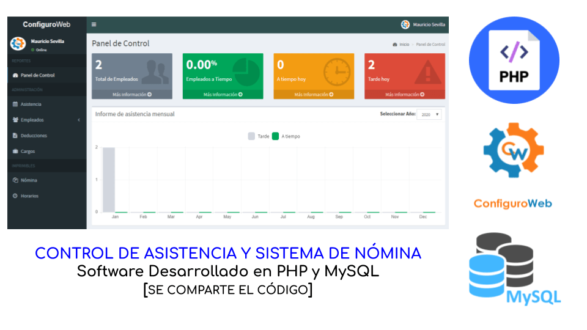

# Control de Asistencia y Sistema de Nómina

Este Control de Asistencia y Sistema de Nómina hecho en PHP y MySQL gestiona los pagos de nómina según los cargos que se crean dentro de la aplicación y las horas que reportan dentro del sistema, está aplicación incluso controla adelantos y deducciones.

La explicación del funcionamiento de la aplicación así como su puesta a punto en un servidor local se explica completamente en el enlace a continugación:
https://www.configuroweb.com/46-aplicaciones-gratuitas-en-php-python-y-javascript/#asistencia-y-nomina

# Contacto
Si tienes dudas sobre el funcionamiento de la aplicación o requieres un desarrollo a medida me puedes contactar en el siguiente enlace de Whatsapp:
https://configuroweb.com/WhatsappMessenger
